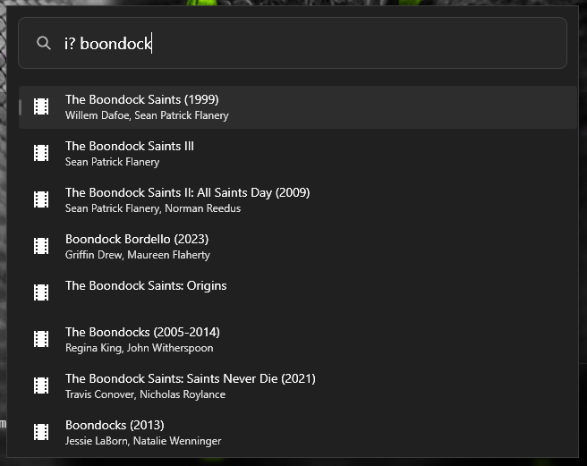

# Plugin for PowerToys Run

This is a plugin for [PowerToys Run](https://github.com/microsoft/PowerToys/wiki/PowerToys-Run-Overview) that allows you to search for movies and actors from the [Imdb](https://imdb.com/) website.

    

## Features

- Search for movies, tvseries and actors from the imdb website
- Or search only for movies from the imdb website

## Installation

1. Download the latest release of the Winget Plugin from the [releases page](https://github.com/morbiddevil/PowerToysRunPluginImdbSearch/releases).
2. Extract the zip file's contents to your PowerToys modules directory (usually `%LOCALAPPDATA%\PowerToys\RunPlugins`).
3. Restart PowerToys.

## Usage

1. Open PowerToys Run (default shortcut is `Alt+Space`).
2. Type `i?` followed by your search query.
3. Select a entry from the search results and press `Enter` to open it in your default browser.

## License

This project is licensed under the [MIT License](LICENSE).
